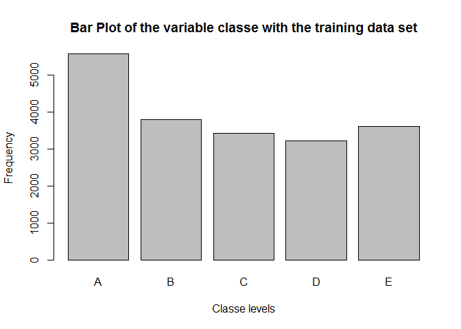

# Practical Machine Learning Prediction Project
Luis Salazar  

## Background
Using devices such as Jawbone Up, Nike FuelBand, and Fitbit it is now possible to collect a large amount of data about personal activity relatively inexpensively. These type of devices are part of the quantified self movement - a group of enthusiasts who take measurements about themselves regularly to improve their health, to find patterns in their behavior, or because they are tech geeks. One thing that people regularly do is quantify how much of a particular activity they do, but they rarely quantify how well they do it. The goal of this project is to use data from accelerometers on the belt, forearm, arm, and dumbell of 6 participants (The training data for this project is available  [here](https://d396qusza40orc.cloudfront.net/predmachlearn/pml-training.csv) and the tests data [here](https://d396qusza40orc.cloudfront.net/predmachlearn/pml-testing.csv), thanks to this [source](http://groupware.les.inf.puc-rio.br/har) ). The participants were asked to perform barbell lifts correctly and incorrectly in 5 different ways. More information is available from the website [here](http://groupware.les.inf.puc-rio.br/har) (see the section on the Weight Lifting Exercise Dataset).

## Pre-Initialization
Before going through the calculations and processing of the data, load required libraries, change the current working directory to match where the root folder containing the data sets and R markdown files ("Predmachlearn_Project"). Code chunks will be echoed, specifying the global flag echo=TRUE. 


```r
library(caret)
```

```
## Loading required package: lattice
## Loading required package: ggplot2
```

```r
library(e1071)
library(data.table)
library(knitr)
library(markdown)
setwd("~/Predmachlearn_Project/")
opts_chunk$set(echo=TRUE)
```

Should any of the libraries be missing, please issue:

```r
install.packages("caret")
install.packages("e1071")
install.packages("data.table")
install.packages("knitr")
install.packages("markdown")
```

The report was Knited from the RStudio editor, but can also be knited with:

```r
knit("PredMachProj.Rmd") ## generates md file
markdownToHTML("PredMachProj.md", "PredMachProj.html") ## generates the html from md file 
```
## Loading and preprocessing the data
The csv files for training and testing are read and loaded into their respective variables.


```r
training <- read.csv("pml-training.csv")
testing <- read.csv("pml-testing.csv")
names(training)
```

```
##   [1] "X"                        "user_name"               
##   [3] "raw_timestamp_part_1"     "raw_timestamp_part_2"    
##   [5] "cvtd_timestamp"           "new_window"              
##   [7] "num_window"               "roll_belt"               
##   [9] "pitch_belt"               "yaw_belt"                
##  [11] "total_accel_belt"         "kurtosis_roll_belt"      
##  [13] "kurtosis_picth_belt"      "kurtosis_yaw_belt"       
##  [15] "skewness_roll_belt"       "skewness_roll_belt.1"    
##  [17] "skewness_yaw_belt"        "max_roll_belt"           
##  [19] "max_picth_belt"           "max_yaw_belt"            
##  [21] "min_roll_belt"            "min_pitch_belt"          
##  [23] "min_yaw_belt"             "amplitude_roll_belt"     
##  [25] "amplitude_pitch_belt"     "amplitude_yaw_belt"      
##  [27] "var_total_accel_belt"     "avg_roll_belt"           
##  [29] "stddev_roll_belt"         "var_roll_belt"           
##  [31] "avg_pitch_belt"           "stddev_pitch_belt"       
##  [33] "var_pitch_belt"           "avg_yaw_belt"            
##  [35] "stddev_yaw_belt"          "var_yaw_belt"            
##  [37] "gyros_belt_x"             "gyros_belt_y"            
##  [39] "gyros_belt_z"             "accel_belt_x"            
##  [41] "accel_belt_y"             "accel_belt_z"            
##  [43] "magnet_belt_x"            "magnet_belt_y"           
##  [45] "magnet_belt_z"            "roll_arm"                
##  [47] "pitch_arm"                "yaw_arm"                 
##  [49] "total_accel_arm"          "var_accel_arm"           
##  [51] "avg_roll_arm"             "stddev_roll_arm"         
##  [53] "var_roll_arm"             "avg_pitch_arm"           
##  [55] "stddev_pitch_arm"         "var_pitch_arm"           
##  [57] "avg_yaw_arm"              "stddev_yaw_arm"          
##  [59] "var_yaw_arm"              "gyros_arm_x"             
##  [61] "gyros_arm_y"              "gyros_arm_z"             
##  [63] "accel_arm_x"              "accel_arm_y"             
##  [65] "accel_arm_z"              "magnet_arm_x"            
##  [67] "magnet_arm_y"             "magnet_arm_z"            
##  [69] "kurtosis_roll_arm"        "kurtosis_picth_arm"      
##  [71] "kurtosis_yaw_arm"         "skewness_roll_arm"       
##  [73] "skewness_pitch_arm"       "skewness_yaw_arm"        
##  [75] "max_roll_arm"             "max_picth_arm"           
##  [77] "max_yaw_arm"              "min_roll_arm"            
##  [79] "min_pitch_arm"            "min_yaw_arm"             
##  [81] "amplitude_roll_arm"       "amplitude_pitch_arm"     
##  [83] "amplitude_yaw_arm"        "roll_dumbbell"           
##  [85] "pitch_dumbbell"           "yaw_dumbbell"            
##  [87] "kurtosis_roll_dumbbell"   "kurtosis_picth_dumbbell" 
##  [89] "kurtosis_yaw_dumbbell"    "skewness_roll_dumbbell"  
##  [91] "skewness_pitch_dumbbell"  "skewness_yaw_dumbbell"   
##  [93] "max_roll_dumbbell"        "max_picth_dumbbell"      
##  [95] "max_yaw_dumbbell"         "min_roll_dumbbell"       
##  [97] "min_pitch_dumbbell"       "min_yaw_dumbbell"        
##  [99] "amplitude_roll_dumbbell"  "amplitude_pitch_dumbbell"
## [101] "amplitude_yaw_dumbbell"   "total_accel_dumbbell"    
## [103] "var_accel_dumbbell"       "avg_roll_dumbbell"       
## [105] "stddev_roll_dumbbell"     "var_roll_dumbbell"       
## [107] "avg_pitch_dumbbell"       "stddev_pitch_dumbbell"   
## [109] "var_pitch_dumbbell"       "avg_yaw_dumbbell"        
## [111] "stddev_yaw_dumbbell"      "var_yaw_dumbbell"        
## [113] "gyros_dumbbell_x"         "gyros_dumbbell_y"        
## [115] "gyros_dumbbell_z"         "accel_dumbbell_x"        
## [117] "accel_dumbbell_y"         "accel_dumbbell_z"        
## [119] "magnet_dumbbell_x"        "magnet_dumbbell_y"       
## [121] "magnet_dumbbell_z"        "roll_forearm"            
## [123] "pitch_forearm"            "yaw_forearm"             
## [125] "kurtosis_roll_forearm"    "kurtosis_picth_forearm"  
## [127] "kurtosis_yaw_forearm"     "skewness_roll_forearm"   
## [129] "skewness_pitch_forearm"   "skewness_yaw_forearm"    
## [131] "max_roll_forearm"         "max_picth_forearm"       
## [133] "max_yaw_forearm"          "min_roll_forearm"        
## [135] "min_pitch_forearm"        "min_yaw_forearm"         
## [137] "amplitude_roll_forearm"   "amplitude_pitch_forearm" 
## [139] "amplitude_yaw_forearm"    "total_accel_forearm"     
## [141] "var_accel_forearm"        "avg_roll_forearm"        
## [143] "stddev_roll_forearm"      "var_roll_forearm"        
## [145] "avg_pitch_forearm"        "stddev_pitch_forearm"    
## [147] "var_pitch_forearm"        "avg_yaw_forearm"         
## [149] "stddev_yaw_forearm"       "var_yaw_forearm"         
## [151] "gyros_forearm_x"          "gyros_forearm_y"         
## [153] "gyros_forearm_z"          "accel_forearm_x"         
## [155] "accel_forearm_y"          "accel_forearm_z"         
## [157] "magnet_forearm_x"         "magnet_forearm_y"        
## [159] "magnet_forearm_z"         "classe"
```

## Cleaning data
To have a cleaner data set for the machine learning, the following was done: remove NA, non-numeric variables, and near zero values.


```r
training <- training[, which(as.numeric(colSums(is.na(training)))==0)]
testing <- testing[, which(as.numeric(colSums(is.na(testing)))==0)]
training <- training[,-(1:7)] ##user_name, timestamps, windows
testing <- testing[,-(1:7)] ##user_name, timestamps, windows
training <- training[, nearZeroVar(training, saveMetrics = TRUE)$nzv==FALSE]
testing <-testing[, nearZeroVar(testing, saveMetrics = TRUE)$nzv==FALSE]
training$classe <- factor(training$classe)

plot(training$classe, main="Bar Plot of the variable classe with the training data set",
     xlab="Classe levels", ylab="Frequency")
```

 

## The prediction
The variable of interest is classe, a factor variable from classe A to classe E, from which classe A is when the participants performed Unilateral Dumbbell Biceps Curl exactly as specified, whilst the other classes represent a common mistake when participants did the exercise. Data has been cleaned to aid in building a better model. Moreover, a seed of 123 has been used on the pseudo-random number generator used afterwards as reproduceability is important.

### Splitting the training data
In order to apply the model to the testing data, the model has first to be tested using well known training data. This data is chosen to be split on 70% for training data and 30% for testing data.

```r
train_idx <- createDataPartition(y = training$classe, p=0.7,list=FALSE);
sub_training <- training[train_idx,];
sub_testing <- training[-train_idx,];
```

### Machine learning models


```r
#seed
set.seed(123)
#two models generated:  random forest ["rf"] and boosted trees ["gbm"]
model_rf <- train(classe ~ ., method = "rf", data = sub_training)    
model_gbm <-train(classe ~ ., method = 'gbm', data = sub_training)
```

### Expected out of sample error

The expected out of sample error will be 1 minus the accuracy in the cross validation data, set partitioned of 70% for training and 30% for testing. For the final testing data set, the expected out of sample error is to be about 1%.


```r
print("Random forest accuracy")
rf_accuracy<- predict(model_rf, sub_testing)
print(confusionMatrix(rf_accuracy, sub_testing$classe))
print("Boosted trees accuracy")
gbm_accuracy<- predict(model_gbm , sub_testing)
print(confusionMatrix(gbm_accuracy, sub_testing$classe))
```

From which the accuracy of those models is 99% for the random forest and 96% for the boosted trees. The chosen model is then random forest.

### Cross-validation
In order to avoid over-fitting in the random forest model, the model is tuned a bit by chosing the number of folds and sets to compute (both 10). 


```r
#seed
set.seed(123)
control <- trainControl(method = "repeatedcv", number = 10, repeats = 10)
model_rf_cont <- train(classe ~ ., method="rf",  data = sub_training, trControl = control)
print("Random forest accuracy after CV")
rf_accuracy_cv <- predict(model_rf_cont , sub_testing)
print(confusionMatrix(rf_accuracy_cv, sub_testing$classe))
```

The accuracy is similar to the one obtained earlier on.

### Order of importance of variables for the model
Running the code shown below, the listing of the variable importance can be seen, from which the most important variable in the model of random forest is roll_belt.


```r
print("Variables importance")
imp = varImp(rf_accuracy_cv$finalModel)
imp$var<-rownames(imp)
imp = as.data.frame(imp[with(imp, order(imp$Overall, decreasing=TRUE)), ])
rownames(imp) <- NULL
print(imp)
```

### Test cases
With the random forest model tuned with cross validation the 20 test cases are predicted and submitted.
